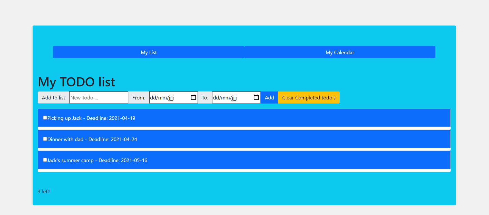

 
 

# ᴄʀᴇᴀᴛɪɴɢ ᴀ ᴛᴏ-ᴅᴏ-ʟɪsᴛ  ᴜsɪɴɢ "ʀᴇᴀᴄᴛ" 

# 🆃🅷🅴 🅰🆂🆂🅸🅶🅽🅼🅴🅽🆃:

### 𝑌𝑜𝑢𝑟 𝑚𝑖𝑠𝑠𝑖𝑜𝑛
𝑇ℎ𝑖𝑠 𝑡𝑖𝑚𝑒 𝑡ℎ𝑒 𝑡𝑎𝑠𝑘 𝑖𝑠 𝑠𝑖𝑚𝑝𝑙𝑒: 𝑦𝑜𝑢 𝑤𝑖𝑙𝑙 𝑏𝑢𝑖𝑙𝑑 𝑎 𝑠𝑚𝑎𝑙𝑙 𝑡𝑜𝑑𝑜 𝑎𝑝𝑝𝑙𝑖𝑐𝑎𝑡𝑖𝑜𝑛 𝑡ℎ𝑎𝑡 𝑙𝑖𝑣𝑒𝑠 𝑖𝑛 𝑦𝑜𝑢𝑟 𝑏𝑟𝑜𝑤𝑠𝑒𝑟, 𝑎𝑛𝑑 𝑠𝑎𝑣𝑒𝑠 𝑡𝑜𝑑𝑜𝑠 𝑒𝑣𝑒𝑛 𝑎𝑓𝑡𝑒𝑟 𝑟𝑒𝑠𝑡𝑎𝑟𝑡𝑖𝑛𝑔 𝑡ℎ𝑒 𝑏𝑟𝑜𝑤𝑠𝑒𝑟.

# 𝐋𝐞𝐚𝐫𝐧𝐢𝐧𝐠 𝐎𝐛𝐣𝐞𝐜𝐭𝐢𝐯𝐞𝐬
𝑇ℎ𝑒𝑟𝑒 𝑎𝑟𝑒 𝑚𝑎𝑛𝑦 𝑓𝑟𝑎𝑚𝑒𝑤𝑜𝑟𝑘𝑠 𝑓𝑜𝑟 𝑚𝑎𝑛𝑦 𝑠𝑖𝑡𝑢𝑎𝑡𝑖𝑜𝑛𝑠. 𝐵𝑎𝑐𝑘-𝑒𝑛𝑑 𝑓𝑟𝑎𝑚𝑒𝑤𝑜𝑟𝑘𝑠 𝑙𝑖𝑘𝑒 𝐿𝑎𝑟𝑎𝑣𝑒𝑙 𝑜𝑟 𝑆𝑦𝑚𝑓𝑜𝑛𝑦 𝑤𝑖𝑙𝑙 𝑚𝑎𝑘𝑒 𝑡ℎ𝑒 𝑙𝑖𝑣𝑒𝑠 𝑜𝑓 𝑏𝑎𝑐𝑘-𝑒𝑛𝑑 𝑑𝑒𝑣𝑒𝑙𝑜𝑝𝑒𝑟𝑠 𝑎 𝑙𝑜𝑡 𝑒𝑎𝑠𝑖𝑒𝑟, 𝑓𝑜𝑟 𝑒𝑥𝑎𝑚𝑝𝑙𝑒. 𝑇ℎ𝑖𝑠 𝑖𝑠 𝑎𝑙𝑠𝑜 𝑡ℎ𝑒 𝑐𝑎𝑠𝑒 𝑓𝑜𝑟 𝑓𝑟𝑜𝑛𝑡-𝑒𝑛𝑑 𝑓𝑟𝑎𝑚𝑒𝑤𝑜𝑟𝑘𝑠 𝑎𝑛𝑑 𝑑𝑒𝑣𝑒𝑙𝑜𝑝𝑒𝑟𝑠. 𝑇𝑜𝑑𝑎𝑦 𝑤𝑒 𝑤𝑖𝑙𝑙 𝑑𝑖𝑣𝑒 𝑖𝑛𝑡𝑜 𝑜𝑛𝑒 𝑜𝑓 𝑡ℎ𝑜𝑠𝑒 𝑎𝑚𝑎𝑧𝑖𝑛𝑔 𝑓𝑟𝑎𝑚𝑒𝑤𝑜𝑟𝑘𝑠 𝑡ℎ𝑎𝑡 𝑐𝑜𝑢𝑙𝑑 𝑚𝑎𝑘𝑒 𝑎 𝑓𝑟𝑜𝑛𝑡-𝑒𝑛𝑑 𝑑𝑒𝑣𝑒𝑙𝑜𝑝𝑒𝑟'𝑠 𝑙𝑖𝑣𝑒 𝑒𝑎𝑠𝑖𝑒𝑟!

## 𝐀𝐭 𝐭𝐡𝐞 𝐞𝐧𝐝 𝐨𝐟 𝐭𝐡𝐢𝐬 𝟓-𝐝𝐚𝐲 𝐜𝐡𝐚𝐥𝐥𝐞𝐧𝐠𝐞 𝐲𝐨𝐮 𝐰𝐢𝐥𝐥:

𝐵𝑒 𝑎𝑏𝑙𝑒 𝑡𝑜 𝑐𝑟𝑒𝑎𝑡𝑒 𝑎 𝑛𝑒𝑤 𝑅𝑒𝑎𝑐𝑡 𝑎𝑝𝑝𝑙𝑖𝑐𝑎𝑡𝑖𝑜𝑛
𝐵𝑒 𝑎𝑏𝑙𝑒 𝑡𝑜 "𝑡ℎ𝑖𝑛𝑘 𝑖𝑛 𝑅𝑒𝑎𝑐𝑡"
𝐵𝑒 𝑎𝑏𝑙𝑒 𝑡𝑜 𝑢𝑠𝑒 𝑏𝑎𝑠𝑖𝑐 ℎ𝑜𝑜𝑘𝑠 𝑓𝑜𝑟 𝑚𝑎𝑛𝑎𝑔𝑖𝑛𝑔 𝑠𝑡𝑎𝑡𝑒 𝑎𝑛𝑑 𝑟𝑒𝑎𝑐𝑡𝑖𝑣𝑖𝑡𝑦
𝐵𝑒 𝑎𝑏𝑙𝑒 𝑡𝑜 𝑜𝑟𝑔𝑎𝑛𝑖𝑧𝑒 𝑦𝑜𝑢𝑟 𝑎𝑝𝑝 𝑖𝑛 𝑐𝑜𝑚𝑝𝑜𝑛𝑒𝑛𝑡𝑠
𝑌𝑜𝑢𝑟 𝑚𝑖𝑠𝑠𝑖𝑜𝑛
𝑇ℎ𝑖𝑠 𝑡𝑖𝑚𝑒 𝑡ℎ𝑒 𝑡𝑎𝑠𝑘 𝑖𝑠 𝑠𝑖𝑚𝑝𝑙𝑒: 𝑦𝑜𝑢 𝑤𝑖𝑙𝑙 𝑏𝑢𝑖𝑙𝑑 𝑎 𝑠𝑚𝑎𝑙𝑙 𝑡𝑜𝑑𝑜 𝑎𝑝𝑝𝑙𝑖𝑐𝑎𝑡𝑖𝑜𝑛 𝑡ℎ𝑎𝑡 𝑙𝑖𝑣𝑒𝑠 𝑖𝑛 𝑦𝑜𝑢𝑟 𝑏𝑟𝑜𝑤𝑠𝑒𝑟, 𝑎𝑛𝑑 𝑠𝑎𝑣𝑒𝑠 𝑡𝑜𝑑𝑜𝑠 𝑒𝑣𝑒𝑛 𝑎𝑓𝑡𝑒𝑟 𝑟𝑒𝑠𝑡𝑎𝑟𝑡𝑖𝑛𝑔 𝑡ℎ𝑒 𝑏𝑟𝑜𝑤𝑠𝑒𝑟.

# 🌱  𝐌𝐮𝐬𝐭-𝐡𝐚𝐯𝐞'𝐬
𝑅𝑒𝑎𝑑 𝑡ℎ𝑖𝑠 𝑑𝑜𝑐𝑢𝑚𝑒𝑛𝑡𝑎𝑡𝑖𝑜𝑛 𝑜𝑛 𝑡ℎ𝑒 𝑏𝑎𝑠𝑖𝑐𝑠

𝐶𝑟𝑒𝑎𝑡𝑒 𝑎 𝑅𝑒𝑎𝑐𝑡 𝑎𝑝𝑝𝑙𝑖𝑐𝑎𝑡𝑖𝑜𝑛 𝑎𝑛𝑑 𝑟𝑢𝑛 𝑖𝑡 𝑙𝑜𝑐𝑎𝑙𝑙𝑦 𝑜𝑛 𝑦𝑜𝑢𝑟 𝑏𝑟𝑜𝑤𝑠𝑒𝑟 (ℎ𝑖𝑛𝑡-ℎ𝑖𝑛𝑡: 𝑠𝑡𝑎𝑟𝑡 ℎ𝑒𝑟𝑒)

𝑃𝑢𝑏𝑙𝑖𝑠ℎ 𝑡ℎ𝑒 𝑠𝑜𝑢𝑟𝑐𝑒 𝑐𝑜𝑑𝑒 𝑜𝑛 𝑦𝑜𝑢𝑟 𝐺𝑖𝑡𝐻𝑢𝑏 𝑟𝑒𝑝𝑜𝑠𝑖𝑡𝑜𝑟𝑦

𝐵𝑢𝑖𝑙𝑑 𝑎 𝑡𝑜𝑑𝑜 𝑎𝑝𝑝 𝑤𝑖𝑡ℎ 𝑅𝑒𝑎𝑐𝑡.𝑗𝑠 (𝐶ℎ𝑒𝑐𝑘 𝑜𝑢𝑡 𝑡ℎ𝑖𝑠 𝑢𝑠𝑒𝑓𝑢𝑙 𝑖𝑛𝑠𝑡𝑟𝑢𝑐𝑡𝑖𝑜𝑛𝑠 )

𝑆𝑎𝑣𝑒 𝑦𝑜𝑢𝑟 𝑡𝑜𝑑𝑜𝑠, 𝑒𝑣𝑒𝑛 𝑎𝑓𝑡𝑒𝑟 𝑠𝑡𝑎𝑟𝑡𝑖𝑛𝑔 𝑡ℎ𝑒 𝑏𝑟𝑜𝑤𝑠𝑒𝑟 𝑎𝑔𝑎𝑖𝑛

𝐷𝑒𝑝𝑙𝑜𝑦 𝑡ℎ𝑒 𝑝𝑟𝑜𝑗𝑒𝑐𝑡 𝑜𝑛 𝑎 𝑙𝑖𝑣𝑒 𝑠𝑒𝑟𝑣𝑒𝑟

𝑇𝑖𝑝 𝑖𝑓 𝑦𝑜𝑢 𝑐ℎ𝑜𝑜𝑠𝑒 𝑁𝑒𝑡𝑙𝑖𝑓𝑦: 𝑡𝑜 𝑑𝑒𝑝𝑙𝑜𝑦 𝑎 𝑅𝑒𝑎𝑐𝑡 𝑎𝑝𝑝 𝑦𝑜𝑢 𝑓𝑖𝑟𝑠𝑡 𝑟𝑢𝑛 𝑡ℎ𝑒 𝑐𝑜𝑚𝑚𝑎𝑛𝑑 𝑛𝑝𝑚 𝑟𝑢𝑛 𝑏𝑢𝑖𝑙𝑑, 𝑎𝑛𝑑 𝑜𝑛𝑐𝑒 𝑡ℎ𝑒 𝑐𝑜𝑚𝑚𝑎𝑛𝑑 𝑓𝑖𝑛𝑖𝑠ℎ𝑒𝑠 𝑦𝑜𝑢 𝑤𝑖𝑙𝑙 ℎ𝑎𝑣𝑒 𝑦𝑜𝑢𝑟 𝑎𝑝𝑝 𝑟𝑒𝑎𝑑𝑦 𝑖𝑛 𝑡ℎ𝑒 𝑏𝑢𝑖𝑙𝑑 𝑓𝑜𝑙𝑑𝑒𝑟: 𝑗𝑢𝑠𝑡 𝑑𝑟𝑎𝑔 𝑎𝑛𝑑 𝑑𝑟𝑜𝑝 𝑡ℎ𝑖𝑠 𝑓𝑜𝑙𝑑𝑒𝑟 𝑖𝑛 𝑁𝑒𝑡𝑙𝑖𝑓𝑦 𝑎𝑛𝑑 𝑦𝑜𝑢 𝑎𝑟𝑒 𝑑𝑜𝑛𝑒. 𝐸𝑎𝑠𝑦!

# 🌼 𝐍𝐢𝐜𝐞-𝐭𝐨-𝐡𝐚𝐯𝐞 (𝐝𝐨𝐚𝐛𝐥𝐞)
𝑅𝑒𝑓𝑎𝑐𝑡𝑜𝑟 𝑝𝑎𝑟𝑡𝑠 𝑦𝑜𝑢 𝑎𝑟𝑒𝑛'𝑡 ℎ𝑎𝑝𝑝𝑦 𝑤𝑖𝑡ℎ.
𝑅𝑒𝑏𝑢𝑖𝑙𝑑 𝑓𝑟𝑜𝑚 𝑠𝑐𝑟𝑎𝑡𝑐ℎ 𝑤𝑖𝑡ℎ𝑜𝑢𝑡 𝑎𝑛𝑦 𝑡𝑢𝑡𝑜𝑟𝑖𝑎𝑙 𝑡𝑜 𝑖𝑚𝑝𝑟𝑜𝑣𝑒 𝑦𝑜𝑢𝑟 𝑢𝑛𝑑𝑒𝑟𝑠𝑡𝑎𝑛𝑑𝑖𝑛𝑔 (𝑖𝑛𝑠𝑡𝑟𝑢𝑐𝑡𝑖𝑜𝑛𝑠 𝑤𝑖𝑙𝑙 𝑏𝑒 𝑜𝑓 𝑎 𝑏𝑖𝑔 ℎ𝑒𝑙𝑝 ℎ𝑒𝑟𝑒!).
𝐼𝑚𝑝𝑟𝑜𝑣𝑒 𝑜𝑛 𝑦𝑜𝑢𝑟 𝑝𝑟𝑜𝑗𝑒𝑐𝑡 𝑠𝑜 𝑡ℎ𝑎𝑡 𝑖𝑡'𝑠 𝑛𝑜𝑡 𝑜𝑛𝑙𝑦 𝑎 𝑙𝑒𝑎𝑟𝑛𝑖𝑛𝑔 𝑟𝑒𝑝𝑜𝑠𝑖𝑡𝑜𝑟𝑦, 𝑏𝑢𝑡 𝑎𝑙𝑠𝑜 𝑎 𝑠ℎ𝑜𝑤𝑐𝑎𝑠𝑒 𝑝𝑟𝑜𝑗𝑒𝑐𝑡 𝑤ℎ𝑒𝑛 𝑖𝑛𝑡𝑒𝑟𝑣𝑖𝑒𝑤𝑖𝑛𝑔:
𝐴𝑑𝑑 𝑠𝑡𝑦𝑙𝑖𝑛𝑔
𝐼𝑚𝑝𝑟𝑜𝑣𝑒 𝑟𝑒𝑠𝑝𝑜𝑛𝑠𝑖𝑣𝑒𝑛𝑒𝑠𝑠
𝐶ℎ𝑒𝑐𝑘 𝑓𝑜𝑟 𝑙𝑖𝑡𝑡𝑙𝑒, 𝑠𝑚𝑜𝑜𝑡ℎ 𝑒𝑓𝑓𝑒𝑐𝑡𝑠
𝑇ℎ𝑖𝑛𝑘 𝑈𝑋: 𝑤ℎ𝑎𝑡 𝑒𝑥𝑡𝑟𝑎 𝑓𝑒𝑎𝑡𝑢𝑟𝑒𝑠 𝑐𝑎𝑛 𝑚𝑎𝑘𝑒 𝑦𝑜𝑢𝑟 𝑡𝑜𝑑𝑜 𝑎𝑝𝑝 𝑏𝑒𝑡𝑡𝑒𝑟?

# 🌳 𝐍𝐢𝐜𝐞-𝐭𝐨-𝐡𝐚𝐯𝐞 (𝐡𝐚𝐫𝐝)
𝐷𝑜𝑛𝑒 𝑤𝑖𝑡ℎ 𝑎𝑙𝑙 𝑡ℎ𝑒 𝑎𝑏𝑜𝑣𝑒? 𝐷𝑜𝑛'𝑡 𝑤𝑜𝑟𝑟𝑦! 𝑊𝑒 ℎ𝑎𝑣𝑒 𝑠𝑜𝑚𝑒 𝑚𝑜𝑟𝑒 𝑦𝑜𝑢 𝑐𝑎𝑛 𝑑𝑜:

𝐼𝑛𝑠𝑡𝑎𝑙𝑙 𝑎 𝑅𝑒𝑎𝑐𝑡 𝑝𝑎𝑐𝑘𝑎𝑔𝑒 𝑜𝑓 𝑎 𝑐𝑎𝑙𝑒𝑛𝑑𝑎𝑟 𝑎𝑛𝑑 𝑖𝑚𝑝𝑙𝑒𝑚𝑒𝑛𝑡 𝑖𝑡 𝑖𝑛 𝑎 𝑛𝑒𝑤 𝑐𝑜𝑚𝑝𝑜𝑛𝑒𝑛𝑡 𝑖𝑛𝑡𝑜 𝑦𝑜𝑢𝑟 𝐴𝑝𝑝.
𝐼𝑛𝑠𝑡𝑎𝑙𝑙 𝑎𝑛𝑑 𝑢𝑠𝑒 𝑅𝑒𝑎𝑐𝑡-𝑟𝑜𝑢𝑡𝑒𝑟-𝑑𝑜𝑚 𝑎𝑠 𝑎 𝑟𝑜𝑢𝑡𝑒𝑟 𝑏𝑒𝑡𝑤𝑒𝑒𝑛 𝑐𝑜𝑚𝑝𝑜𝑛𝑒𝑛𝑡𝑠. (𝐻𝑖𝑛𝑡: 𝑇ℎ𝑖𝑛𝑘 𝑎𝑏𝑜𝑢𝑡 𝑎 𝑠𝑡𝑟𝑢𝑐𝑡𝑢𝑟𝑒 𝑙𝑖𝑘𝑒: 𝑟𝑜𝑢𝑡𝑒𝑟 -> 𝑠ℎ𝑜𝑤 𝑐𝑜𝑚𝑝𝑜𝑛𝑒𝑛𝑡) 
𝑆𝑒𝑒 𝑖𝑓 𝑠𝑜𝑚𝑒𝑜𝑛𝑒 𝑒𝑙𝑠𝑒 𝑛𝑒𝑒𝑑𝑠 ℎ𝑒𝑙𝑝.

𝐻𝑎𝑣𝑒 𝑎 𝑙𝑖𝑣𝑒 𝑒𝑑𝑖𝑡 𝑜𝑝𝑡𝑖𝑜𝑛 𝑓𝑜𝑟 𝑒𝑥𝑖𝑠𝑡𝑖𝑛𝑔 𝑡𝑜𝑑𝑜𝑠 (𝑤ℎ𝑒𝑛 𝑦𝑜𝑢 𝑐𝑙𝑖𝑐𝑘 𝑜𝑛 𝑡ℎ𝑒 𝑡𝑒𝑥𝑡 𝑜𝑓 𝑎 𝑡𝑜𝑑𝑜, 𝑡ℎ𝑒 𝑎𝑝𝑝 𝑎𝑙𝑙𝑜𝑤𝑠 𝑦𝑜𝑢 𝑡𝑜 𝑒𝑑𝑖𝑡 𝑖𝑡 𝑖𝑛 𝑝𝑙𝑎𝑐𝑒).
𝑀𝑎𝑘𝑒 𝑎 𝑣𝑒𝑟𝑠𝑖𝑜𝑛 𝑤𝑖𝑡ℎ 𝑎𝑛𝑜𝑡ℎ𝑒𝑟 𝐽𝑆 𝑓𝑟𝑎𝑚𝑒𝑤𝑜𝑟𝑘 𝑙𝑖𝑘𝑒 𝑉𝑢𝑒𝐽𝑆 𝑜𝑟 𝑆𝑣𝑒𝑙𝑡𝑒.

# Used techs 

	<code></code>
	<code></code>
	<code></code>
	<code></code>
	<code></code>
	<code></code>
	<code></code>

#  ᙅᕼᙓᙅK ᙏY ᗩᑭᑭ....
 ƑҽҽӀ ƒɾҽҽ էօ էҽӀӀ ʍҽ ահąէ վօմ էհìղҟ ąҍօմէ ìէ!   
 

 
